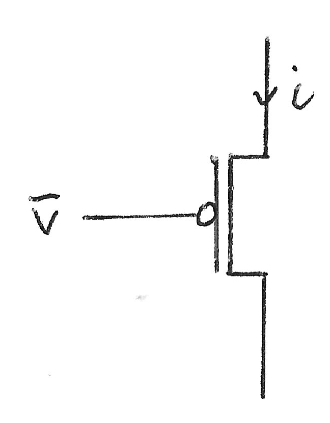
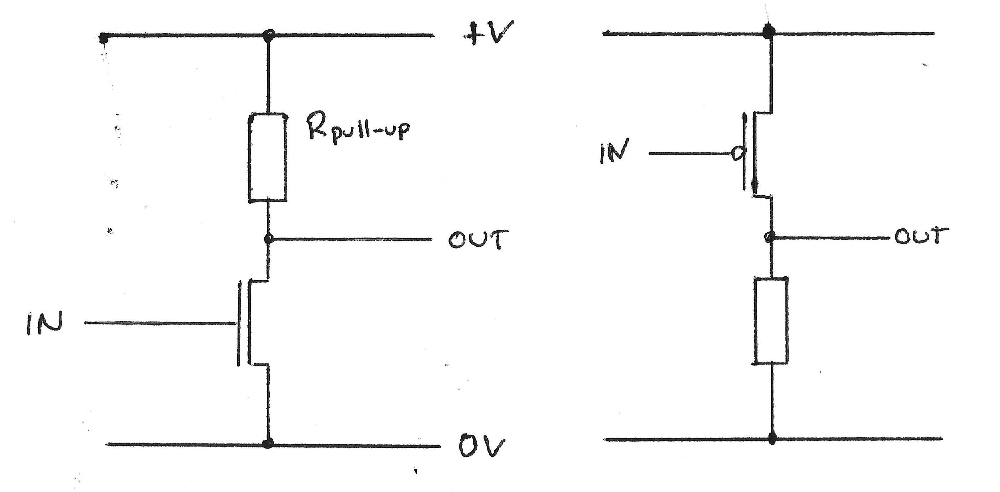
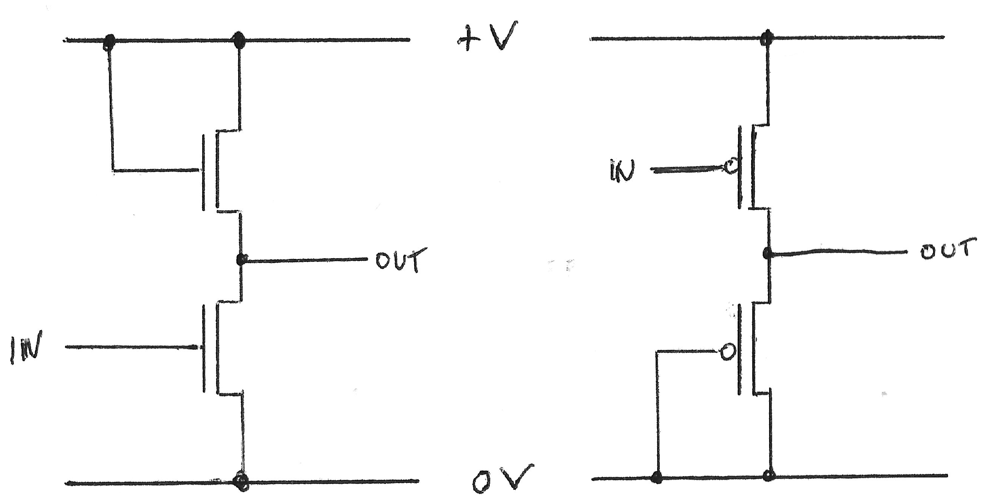
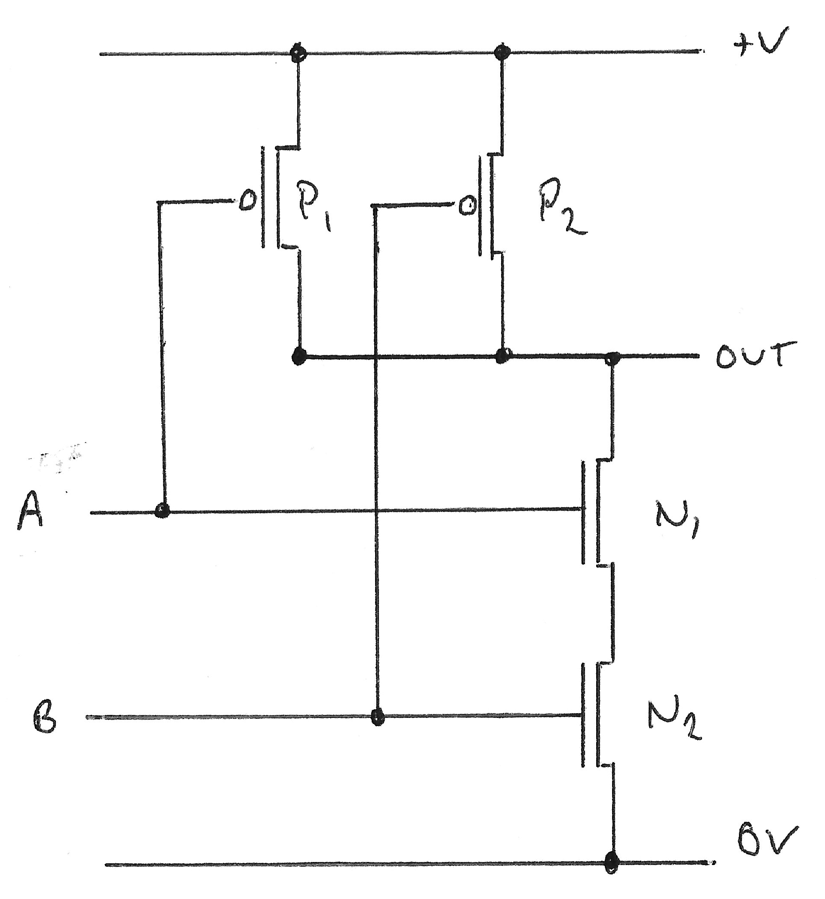

# CMOS Logic Circuits

*Pages 90 - 96*

CMOS stands for Complimentary Metal Oxide Silicon. It is a collection of two different technologies, NMOS (Negative) and PMOS (Positive).

## NMOS

* Conducts for $V > x$, where $x$ is a threshold.
* On resistance is $\approx 10^2\Omega$.
* Off resistance is of the order $G\Omega$.

## PMOS

* Conducts for $V < x$, where $x$ is a threshold.
* On resistance is $\approx 10^2\Omega$.
* Off resistance is of the order $G\Omega$.

## Inverters using both PMOS and NMOS

Recall inverters from previous lectures.

But because we want our circuit to be use only transistors we can use another transistor in place of the resistors. 

But this acts as a potential divider, so the output voltage is half the input voltage, and therefore in the *forbidden region*.

To prevent this from happening both inverters need ratioing to ensure $V_{OL}<<V_{OH}$.

This can be done by combining the two technologies:

<!--Hack so pandoc works-->
<!---->

| Input | P | N | Output |
|-------|---|---|--------|
|  0    |On |Off|1       |
|  1    |Off|On |0       |

This circuit now doesn't need ratioing as you have a complimentary technologies. 

## CMOS NAND

                      

Which gives us a characteristic table, including the states of each transistor as follows

| A | B | $N_1$ | $N_2$ | $P_1$ | $P_2$ | Output |
|---|---|-------|-------|-------|-------|--------|
| 0 | 0 | Off   | Off   | On    | On    | 1      |
| 0 | 1 | Off   | On    | On    | Off   | 1      |
| 1 | 0 | On    | Off   | Off   | On    | 1      |
| 1 | 1 | On    | On    | Off   | Off   | 0      |

Then to make an AND gate you can just add an inverter, which is why a NAND gate takes longer to process then a NAND gate.

## Performance

* High speed (now)
* Power consumption
    * 0 when not switching
    * So therefore it is very low

These two reasons are why CMOS is dominant.

* The fanout is very good because the gain is high
* Noise margin is related to the fanout - therefore it is also good

There is an old danger of static, which doesn't really apply now because of diodes used in protection.
