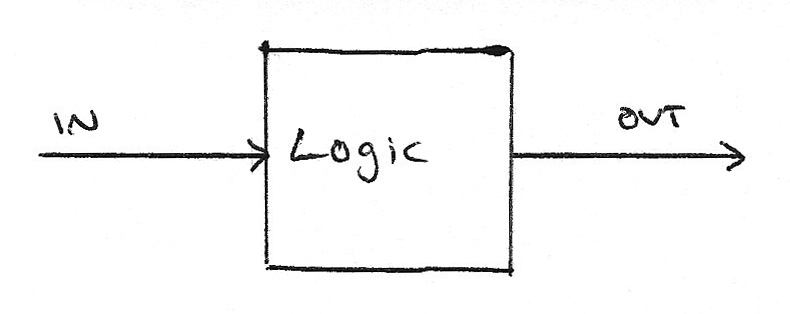
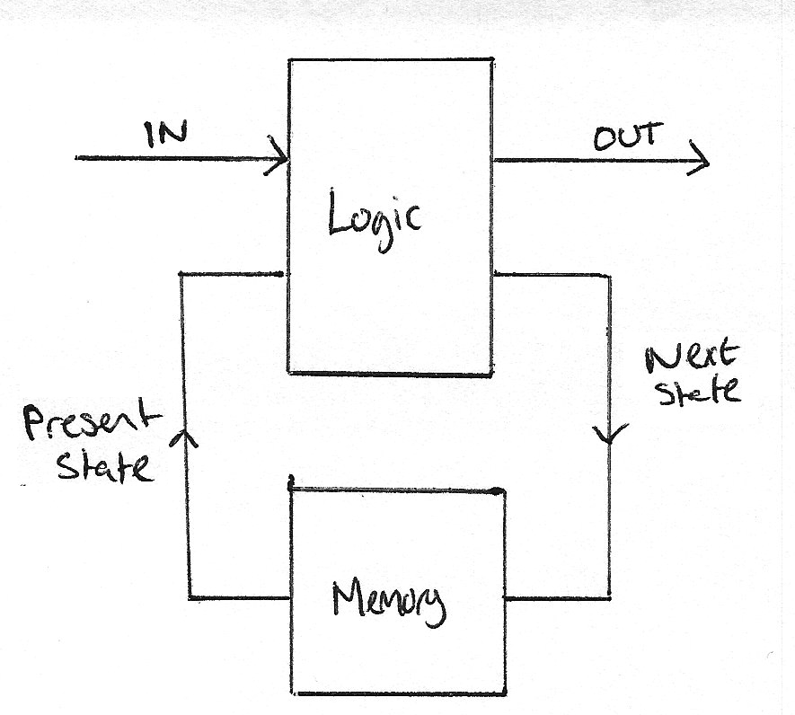
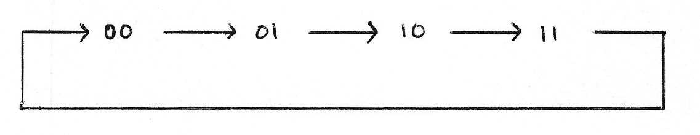
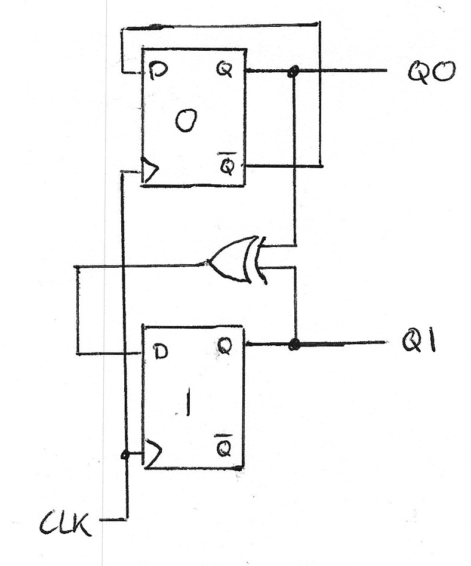
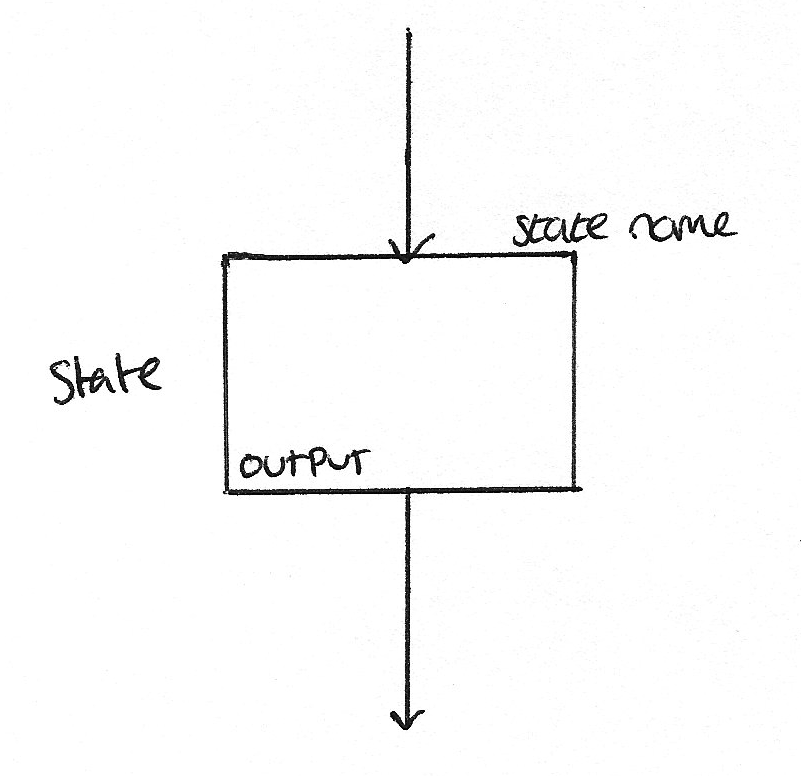
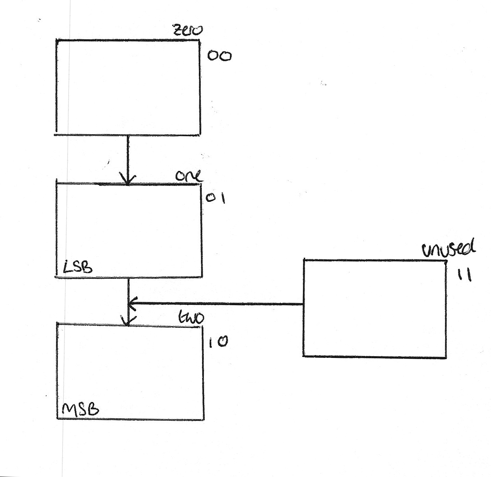
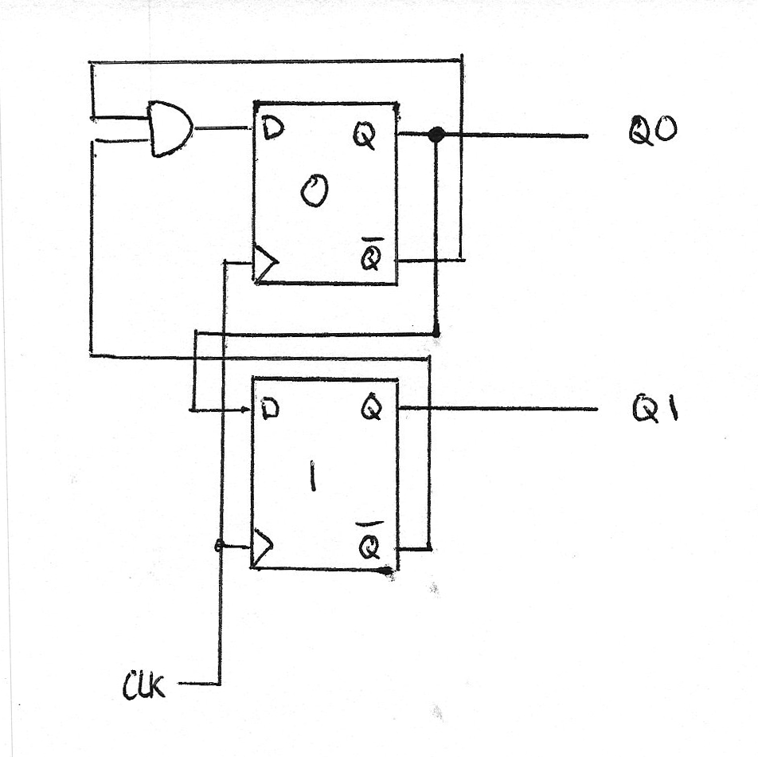

# Algorithmic State Machines

ASMs are machines that vary their output based on their current state and inputs. They have four main features.

1. Outputs
2. Present State
3. Next State
4. Next State Logic

Combinational logic bases its outputs only on the inputs. The output is a combination of the inputs.

Sequential logic is based on the inputs and some form of memory. The four main components are shown in the diagram also. 

In the diagram the memory block can be considered to be a block of flip-flops. For a system with $2^n$ states you will require $n$ flip-flops to implement it.

## Designing a 2-bit Counter

**1** First, we must functionally describe the system, which can be done in a diagram.

Where $xy$ represents the two outputs, $Q0$ and $Q1$. Each of the transitions, shown by an arrow, happen on a rising clock edge.

**2** Next, we draw a "truth table" showing the output from the circuit based on it's inputs and state.

| Q1 | Q0 | Q1n | Q0n |
|----|----|-----|-----|
| 0  | 0  | 0   | 1   |
| 0  | 1  | 1   | 0   |
| 1  | 0  | 1   | 1   |
| 1  | 1  | 0   | 0   |

**3** Then, by using k-maps or observation we can form equations to describe the system

$$ Q1_n = Q1 \oplus Q0 = \overline{Q0}Q1 + Q0\overline{Q1} $$

$$ Q2_n = \overline{Q0} $$

**4** Finally, we can use these equations and the number of states to draw a circuit diagram.

## The fundamentals of ASM Design

You receive a problem described in natural language. These are the steps you take to implement it.

1. Use the description to design an ASM chart. This is often the hardest step.
2. Allocate a binary case to each state.
3. Create a state transition table.
4. Form a boolean expression from the table.
5. Implement that logic in hardware.

## ASM Charts

Each state in an ASM chart has a label with text describing the state and a square with the output. The arrows show what puts it into that state and the arrow leaving it show which state it goes into next.

## Designing a synchronous Divide-by-3 counter.

This is a counter that counts up to three in binary.

1. ASM Chart

2. State Variables

As shown on the diagram above, the three useful registers have their binary value as their variable, and the unused one has a value of 3.

3. State Transition Table

| Q1 | Q0 | Q1n | Q0n | MSB | LSB |
|----|----|-----|-----|-----|-----|
| 0  | 0  | 0   | 1   | 0   | 0   |
| 0  | 1  | 1   | 0   | 0   | 1   |
| 1  | 0  | 1   | 1   | 1   | 0   |
| 1  | 1  | X   | X   | X   | X   |

4. Derive logic equations

$$ Q1_n = \overline{Q1}Q0 = Q0 $$
$$ Q0_n = \overline{Q1}\overline{Q0} $$

5. Implement in hardware

