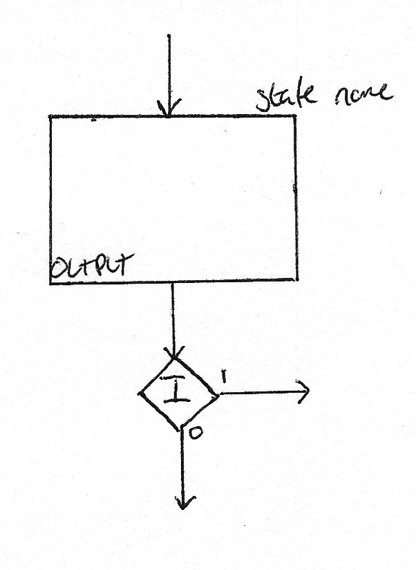
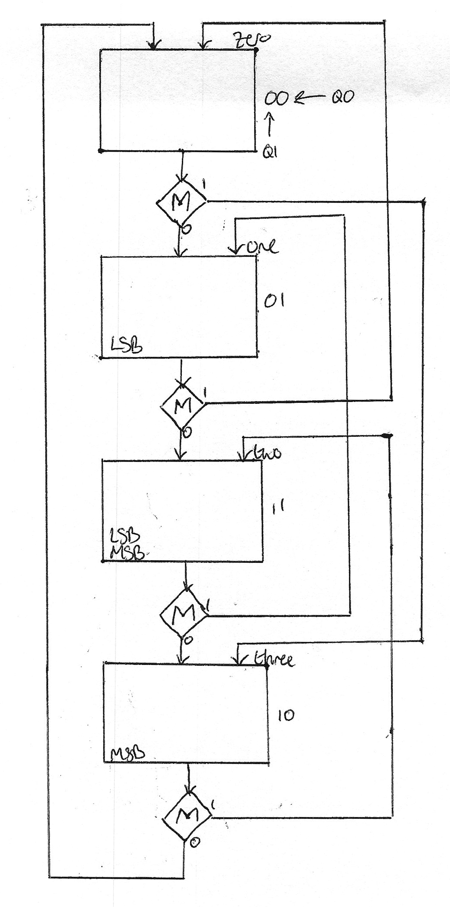
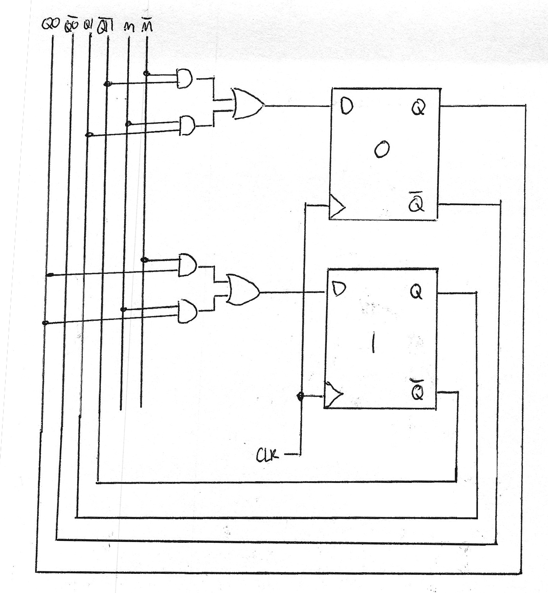

To design more generic systems we need to be able to utilise inputs. Inputs are shown as decision diamonds in ASM charts.

Now we can use inputs let's design a 2-bit counter that counts up and down based on an input. The input, `MODE` or `M`, will cause the counter to count up when it is `'0'` and count down when it is `'1'`. 

To make it slightly easier we will use grey coding. This is a binary system where only one bit changes per increment.

| Denary | Binary | Grey Encoding |
|--------|--------|---------------|
| 0      | 00     | 00            |
| 1      | 01     | 01            |
| 2      | 10     | 11            |
| 3      | 11     | 10            |

First we design an ASM chart.

Then we allocate state variables, which are shown on the ASM chart. Next we form a State Transition Table.

| $M$ | $Q1$ | $Q0$ | $Q1_n$ | $Q0_n$ | $MSB$ | $LSB$ |
|-----|------|------|--------|--------|-------|-------|
| 0   | 0    | 0    | 0      | 1      | 0     | 0     |
| 0   | 0    | 1    | 1      | 1      | 0     | 1     |
| 0   | 1    | 0    | 0      | 0      | 1     | 0     |
| 0   | 1    | 1    | 1      | 0      | 1     | 1     |
| 1   | 0    | 0    | 1      | 0      | 0     | 0     |
| 1   | 0    | 1    | 0      | 0      | 0     | 1     |
| 1   | 1    | 0    | 1      | 1      | 1     | 0     |
| 1   | 1    | 1    | 0      | 1      | 1     | 1     |

Next we can for equations for the next state.

$$ Q1_n = \overline{M}Q0 + M\overline{Q0} $$

$$ Q0_n = \overline{M}\ \overline{Q1} + MQ1 $$

$$ \textrm{MSB} = Q1;\ \ \textrm{LSB} = Q0 $$

Then finally this can be implemented in hardware, using a slightly new technique to keep things cleaner when in larger systems.

